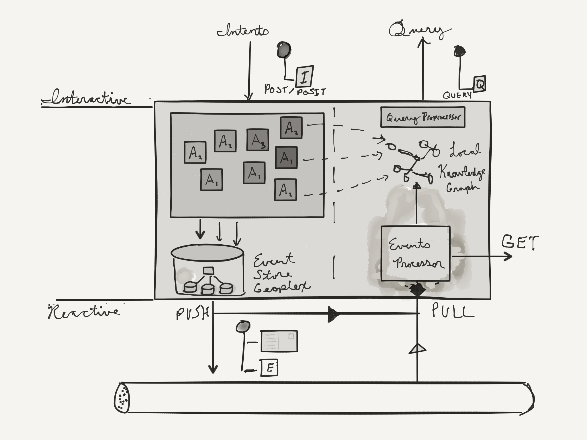

Hyperobjects: An Architectural Style for the Event-Driven Enterprise
====================================================================

Introduction
------------

This document is an attempt to describe an architectural style I call
Hyperobjects. I'm documenting it because I've found it useful in
building enterprise systems, and I'm hopeful that it could serve others.

To the extent possible, I've tried to write this up without introducing any new
terminology or concepts to the professional vernacular. So, I've assumed
familiarity with the concepts detailed in *Domain Driven Design* [DDD],
"Architectural Styles and the Design of Network-based Software Architectures"
[Fielding], *Enterprise Integration Patterns* [Hohpe], as well as Command Query
Responsibility Segregation (Dahan) and Event Sourcing (Young). For the sake of
clarity, this document discusses things concretely, assuming the use of HTTP and
JSON over TCP/IP networks.

Earlier versions of this document used the term microservices quite liberally.
I've eschewed that usage because I do not believe there is sufficient agreement
on what the term means for it to be useful here. However, in the final major
section there is some discussion of Hyperobjects vis-à-vis microservices.

### Acknowledgements

> No one can take from us the joy of the first becoming of aware of something,
> the so-called discovery. But if we also demand the honor, it can be utterly
> spoiled for us, for we are usually not the first. What does discovery mean,
> and who can say that he has discovered this or that? After all it's pure
> idiocy to brag about priority; for it's simply unconscious conceit, not to
> admit frankly that one is a plagiarist. - Johann Wolfgang von Goethe

While I've made an express attempt to acknowledge primary sources where
appropriate, I feel compelled to specifically acknowledge a few people whose
writings and presentations have been my primary influences in developing this
architectural style. Thank you Alan Kay, Werner Vogels, Eric Evans, Joe
Armstrong, Roy Fielding, Udi Dahan, Greg Young, Jim Webber, Rich Hickey, David
Nolen, and David Luckham.

TL;DR
-----

Build all of your services as event-sourced, RESTful Bounded Contexts with a
Uniform Interface of message-orientation and Event-Time semantics. Allow
services to autonomously organize by emitting hypermedia events on a universal
backplane. Aggregate these services as necessary to provide purpose-specific
abstractions.



Overview
--------

> Je n’ai fait celle-ci plus longue que parce que je n’ai pas eu le loisir de la
> faire plus courte. - Blaise Pascal

> I would have written a shorter letter, but I didn't have the time.

Hyperobjects is an architectural style for distributed systems whose primary
design objective is enabling simple, scalable, and reliable enterprise-scale
cloud architectures. The primary constraints of this style are:

* Universal Hypermedia Events (UHE): _Hypermedia event messages_ sent across a
  Universal Backplane as the engine of _Enterprise_ state
* CQRS+ES: Command Query Responsibility Segregation + Event Sourcing
* Domain Driven Design Resources (3DR): Services define a Bounded Context /
  Aggregate Roots are REST Resources
* Interactive Intent (I2): Aggregates implement uniform composable messaging
  semantics, namely Intents, for on-line (interactive) commands
* Event Time (ET): All Aggregate Roots provide uniform Event Time semantics
  for all Events and Representations, entailing time as a first-class property
  of all service interactions
* Dynamic Query (DQ): Services must implement a uniform dynamic query interface
* Layered + Cient-cache + Uniform Interface per Fielding
* Browsable API: Services _should_ provide a browser-based interface to
  interactive documentation

_(If you are very familiar with Fielding, my feeble attempt at emulating
his concision: **(Browsable) LC$U-DQ-3DR-I2-ET-CQRS+ES-UHE**)_

The style is described at two levels: the System-level and the
Service-level. The System-level describes the style as an enterprise
architecture, whereas the Service-level describes the constraints and behaviors
of component services within the enterprise architecture. The design space
inhabited by this style, distributed enterprise systems, necessarily constrains
both the services and environment in which services interrelate.

### Contents

0. Motivation
1. Defining the Constraints of the Hyperobjects Style 
2. Service View
3. System View
4. Elaborations; Related and Future Work

Motivation
==========

There are four main themes to the concerns Hyperobjects aims to address:

* fostering serendipity
* simplicity and ease of implementation
* scalability and reliability
* correctness and time

### Foster Serendipity

Eric Evans calls it supple design; the idea is that our architecture should
foster an environment where new requirements are easy to satisfy in a simple
way. Consider services like IFTTT or Zapier that enable non-trivial workflows to be
built from simple webhook technologies. Our enterprise architectures should be
at least as accommodating, allowing reactivity across various silos.

At the application level, new requirements often mean presenting existing
functionality in slightly different ways: a different view on the same data, or
a permutation of existing commands. Technologies like Falcor and Relay have
ushered in so-called
[demand-driven architecture](https://www.infoq.com/presentations/domain-driven-architecture),
while companies like AWS and Netflix have shown the advantages of creating
top-level services, ["experience-based
apis"](http://www.danieljacobson.com/blog/306), that aggregate baseline services
to provide agility and specificity in the application layer.

[Fostering serendipity](https://www.infoq.com/presentations/vinoski-rest-serendipity)
means ensuring the data and commands clients require to acheive their goals are
readily available without resorting to making goal-specific changes to our
services.

### Simplicity and Ease of Implementation

> Simplicity is a prerequisite for reliability. - Edsger W. Dijkstra

In ["Simple Made Easy"](https://www.infoq.com/presentations/Simple-Made-Easy),
Rich Hickey emphasized the dangers of conflating simplicity and ease. Others
have employed the term "pit of success" to describe the intention of making the
simple and correct approach the easiest to adopt.

### Scalability and Reliability

> Non-functional requirements are those that, if not met, will make your system
> non-functional. - [Andrew Clay Shafer](https://twitter.com/M_r_a_x/status/725695757999833090)


> A distributed system is one in which the failure of a computer you didn't even
> know existed can render your own computer unusable. - [Leslie Lamport](http://research.microsoft.com/en-us/um/people/lamport/pubs/distributed-system.txt)

[Joe Armstrong offers this syllogism](https://www.infoq.com/presentations/self-heal-scalable-system):
> Fault tolerance implies scalability
> * To make things fault-tolerant we have to make sure they are made from isolated components
> * If the components are isolated they can be run in parallel
> * Things that are isolated and can be run in parallel are scalable

As Werner Vogels [has long espoused](#appendixA), services should make progress
under all circumstances. We must build our services to work asynchronously,
independently, and we will get scalability as a consequence of this fault
tolerance.

### Correctness and Time

In recent years functional programming has made huge in-roads into mainstream
software development practice. Concomitantly, ideas from FP like immutability
have found their way into traditional enterprise OOP. Reactive Programming is
driving many of the innovations in front-end development, and CRDTs are seeing
broader adoption. Finally, testing techniques and tools abound alongside
academic innovations in theorem proving, property-based testing, concolic
testing, and other automated analysis techniques.

The salient point in all of these examples is an emphasis on correctness,
specifically on building confidence in the software we are shipping; this
confidence is a prerequisite for continuous delivery. Distributed systems entail
a reality of eventual consistency and regular failure. In particular, state and
time are hard; we want to make them easy by simplifying and rigorously
controlling how they are handled.


Defining the Constraints of the Hyperobjects Style 
==================================================

**(Browsable) LC$U-DQ-3DR-I2-ET-CQRS+ES-UHE**

### Domain Driven Design Resources

Services in Hyperobjects implement a single Bounded Context, and expose it via
REST-like interface.

-------------------------------------------------------------------------
| DDD Concept                      | REST Concept                       |
|----------------------------------|-------------------------------------
| Bounded Context                  | Network Domain                     | 
| Aggregate                        | Resource Type                      | 
| Aggregate Root                   | Resource Instance                  |
| Value in Event Time of an Entity | Representation                     |
| Entity                           | Only accessible via Aggregate Roots|

```
https://consumer-shopping-context.contoso.com/consumer-shopping-cart/42924579adkfajl32792i98f98
        \--------- bounded context ---------/\---- aggregate ------/\--- aggregate root id ---/
```

The primary benefit of this constraint is uniformity of implementation.

### Event-Time

Every Aggregate Root has it's own logical clock. As it changes, this clock is
incremented and used in all identifiers exposed by the service. In this way the
system is made explicitly aware of a resource's location in space and time in
all communications.

By constraining all service interactions to have explicit, regular spacetime
semantics, we can ameliorate an entire class of bugs related to causality,
improve the debuggability of our systems, and introduce capabilties such as:

* point-in-time distributed consistency
* entity timeline inspection
* forking an entity from a previous point-in-time
* safe "what-if" operations

### Interactive Intents

Clients get work done by sending Command Messages to services. These are called
Intents to reflect both their provisional nature and their role in the service
design--capturing the intention of the user or system-actor. In practice,
Intent modeling is a powerful tool for knowledge crunching.

Intents are part of the Uniform Interface for Hyperobjects; they define a
standard envelope format for all Command Messages sent to the interactive
interface of services.

A key aspect of this constraint is composability. Well-defined rules establish
means for clients to compose various Intents into an atomic command. There are
two kinds of composition defined: linear and parallel.

In linear composition individual Intents are processed against the same target.
The constituent Intents are processed sequentially in event-time. So the result
of processing a linear composition is to move the timeline forward for the
target. In parallel composition individual Intents or linear compositions are
processed independently, resulting in separate timelines.

The mechanics of Intent composition will be discussed at length in later
sections, but the salient point is that it **allows clients to synthesize new
capability from existing commands without making changes to the service**.

### Dynamic Query

Clients should be able to specify their own queries rather than being saddled
with the singular representation format of the resources owned by a Hyperobject.
Hyperobjects must implement a Query interface that allows clients to specify
these in a request-response or persistent connection. For example, Hyperobjects
in your enterprise may implement an interface that accepts OData or Falcor or
Relay (or all three) queries, and they could also allow these over a websocket,
allowing for streaming updates to the client.

### Universal Hypermedia Events

All Hyperobjects emit an event stream to a universal backplane and subscribe to
events on the same. Hypermedia events typically do not contain any data other
than the URL of the Aggregate Root that originated the event and the URN of the
event type itself. Concordantly, subscribers to that URN generally dereference
the URL in order to act upon the event. This dynamic prevents eventing from
degenerating into RPC, allows services to maintain precisely one interface for
data access, and allows the event consumer an opportunity to act upon the exact
state of the resource at processing time rather than at event time.

### Uniform Interface

For various reasons a company might choose polyglot SOA as an enterprise
strategy, but the Uniform Interface constraint of Hyperobjects requires that
each of these services meet the Interactive Intents, Dynamic Query, Universal
Hypermedia Events, and Event-Time constraints. These constraints collectively
entail specific interaction and metdata semantics described later.

### Browsable APIs: Interactive Documentation

Hyperobjects should provide a developer UI that serves to both document the
service as well as providing a playground/sandbox for the developer to
experiment within.

TODO
* Amundsen?
* Vs Swagger UI
* Datomic


### Whence REST?

Hyperobjects strengthens and enriches some constraints of REST, relaxes
others, and adds new ones. It attempts to synthesize architectural constraints
entailed by practicing Domain Driven Design, CQRS, and Event Sourcing, as well
as codifying the principles of distributed computing. One specific relaxation I
would call out is the stateless server constraint. Depending on the
concrete implementation, it may be the case that an Aggregate Root remains
pinned to a particular server in the cluster.

Service View
============

The primary building block of the Hyperobjects style are Hyperobjects
themselves. These are autonomous services that own a well-defined area of
knowledge, a Bounded Context, in our enterprise. They are connected by a
universal backplane described in System-level Architecture and are aggregated
and/or proxied by Application Gateways (aka View Model servers, Frontend
Servers, Experience-based APIs) as necessary.

To understand the Service-level architecture, we need to establish some
terminology.

Hyperobject Concepts
--------------------

Hyperobjects have two primary external interfaces: an Interactive Interface that
exhibits Command-Query Responsibility Segregation and a Reactive Interface that
connects to the universal backplane for hypermedia events.


### Interactive Interface

The Interactive Interface of a Hyperobject is an online transaction processing
interface. As such is must obey certain principles of distributed systems. In
particular, all operations (commands or queries) must act only on local
knowledge. Other principles are described in [Appendix A](#appendixA), but the
local knowledge constraint has several important implications. First, it implies
that each Hyperobject has a private local repository of knowledge about itself
and information replicated from other sources of knowledge; it has a copy of all
the data it needs to work. This local knowledge is kept updated via the Reactive
Interface described later.

The Interactive Interface is segregated into to an Intent (command) surface and a
Query surface. Access to these surfaces is mitigated by URL and Verb.

#### URLs

```
https://consumer-shopping-context.contoso.com/consumer-shopping-cart/42924579adkfajl32792i98f98
        \--------- bounded context ---------/\---- aggregate ------/\--- aggregate root id ---/
```
All Hyperobjects URLs are translucent identifiers with a regular structure that delineates
constituent API surfaces. There are four primary URL types.

- Bounded Context  
  //**consumer-shopping-context.contoso.com**/  
  Exposes service metadata (available Intents, emitted Events)  
  Also serves as entry-point for browsable interactive documentation  
  Supports: GET, QUERY
  
- Aggregate  
  //consumer-shopping-context.contoso.com/**cart**/  
  Exposes Query surface for a Resource Type e.g. Carts  
  Admits creation of new aggregate roots  
  Supports: GET (metdata), QUERY, POST, POSIT

- Continuant  
  //consumer-shopping-context.contoso.com/cart/**4b9z479akfj8**  
  The stable identity of an Aggregate Root as it changes over time,
  i.e. nominates the "current version" of a particular Aggregate Root  
  Primary API surface, implements domain operations (i.e. POSTed Intents)  
  Supports: GET, POST, DELETE

- Revision  
  //consumer-shopping-context.contoso.com/cart/4b9z479akfj8/**101**  
  Nominates an Aggregate Root at a particular point-in-event-time, e.g. 101  
  Generally exposes the same operational semantics as the Continuant, but
  results in a new Aggregate Root, a fork of the original at the
  point-in-event-time nominated by the Revision  
  Supports: GET, POST, POSIT

- History  
  //consumer-shopping-context.contoso.com/cart/4b9z479akfj8/**history**  
  An event-time ordered, paged listing of the events that have transpired for a
  particular Aggregate Root  
  Supports: GET

#### Supported Verbs

> The most important thing about object-oriented thinking is getting the verbs
> right. - attributed to Alan Kay in "Points of View", pg 113

From HTTP we take GET, POST and DELETE, to which we add POSIT and QUERY.

POSIT adopts the application-level semantics of an equivalent POST but removes
any durable change. In other words, it functions exactly as if you had performed
a POST, but there is no change of state in the service. Thus, unlike POST, POSIT
is safe and idempotent. The primary use of this verb is to allow clients to peek
into the future, asking "what if" questions. The body of any POST or POSIT must
always be an Intent supported by the Aggregate.

QUERY adopts the semantics of GET; it is safe and idempotent. However, it allows
for a body in the request, the query itself, with the query langage nominated by
the Content-Type header.

#### Revisions

Thus, every 200-level (successful) response contains a Representation
of a particular *Revision* of an Aggregate Root. Both that revision and the
Event that engendered it can be identified by the Event-Time. Since history is
immutable, the Revision can be permanently cached by clients.

### Intents

- Activity Name: names the Intent, nominating the semantics for the Data property
- Id: correlation identifier returned in the Resource Representation, opaque to service
- Data: a JSON object representing the Command Message 

```
POST /cart/4b9z479akfj8
{ "activity" : "urn:com:constoso:shopping:bundle:add-item",
  "id" : "asi292kajfl",
  "data" : {
    "item-id" : "ASD2AK",
    "quantity" : 2
  }
}
```
#### Activity Name

URNs of the form `urn:tenant:bounded-context:entity:verb`, denoting either an
Intent (imperative) or an Event (past-participle), e.g.:

- Intent URN: `urn:com:contoso:consumer-shopping:cart:checkout`
- Event URN:  `urn:com:contoso:consumer-shopping:cart:checkout-succeeded`

Or,

- Intent URN: `urn:com:contoso:consumer-shopping:bundle:add-item`
- Event URN:  `urn:com:contoso:consumer-shopping:bundle:item-added`


### Dynamic Query

Dynamic Query is a key constraint of this architectural style, but the exact
implementation described here is intended to be suggestive rather than
prescriptive. The salient point is that a client can define a particular view
over the data owned by a Hyperobject in a language that is uniformly supported
in the enterprise (e.g. SQL, EDN, GraphQL, etc.).

Additionally, this query should be supported as a transient subscription. For
example, a websocket connection, server sent events, Comet-style connections are
all channels that could keep a client updated as the results of a query are
updated.

### Events

- A Value that serves as the record that a particular business activity has transpired
- Not always in one-to-one correspondence to an Intent, but can usually be
  viewed semantically as the "past tense" of an Intent.

Recall that every Aggregate Root has it's own logical clock. This is enabled by
Event Sourcing.

POSTed Intents are the only write operations in Hyperobjects. Every write
operation is linearized, since time-ordering requires a single arbiter of order
and single-writer models are simple, performant, and robust. There are two
effects in the processing environment:

* Encapsulated: the resultant Event is stored in a private (geoplexed) Event Store
  which is eventually replicated into universal backplane as a hypermedia event
* Observable: the HTTP response containing a Representation of the new projected state

Both of these effects are associated with a new identifier: the Revision URL.
Recall the Revision URL has an positive integer as its final component; this
number acts as an independent logical clock for each Aggregate Root, defining
Event-Time (versus Processing Time) for every Entity within the Aggregate Root.

In Hyperobjects, there is no global time, and processing time--that is, wall-clock
time when an event was received--is only interesting insofar as it is leveraged
by Event Processors to create partially-ordered sets of events (see posets in
Luckham) or [windowing](https://www.oreilly.com/ideas/the-world-beyond-batch-streaming-101).


To understand the relationship between Intents, Events, and the HTTP
request/response, it's easiest to look at the request processing pipeline of a
Hyperobject.

```
Parse     :: HTTP Request -> Intent?
Conjugate :: Intent -> State -> Event?
Apply     :: Event  -> State -> State'?
Store     :: Event  -> void?
Project   :: State' -> HTTP Response
```

Note that outputs in question, e.g. `Intent?`, indicate a possible point of
early exit from the pipeline should the stage fail, due to e.g. a malformed
request. A further caveat: this presentation of the Hyperobject pipeline is a
slightly simplified version of how a POSTed Intent is handled within an
Aggregate Root.


#### Event Store Geoplex

Until an event is written here, it didn't happen.

In describing disaster tolerance, Jim Gray coined the term
[_geoplex_](https://arxiv.org/pdf/cs/9912010.pdf) to describe a collection of
"farms" for the duplication of data, hardware, and applications at one or more
geographically remote locations. I will use the term as a verb; to geoplex
is to ensure that data is committed atomically to disparate geographic
locations.

The geoplexing requirement might be relaxed for deployments that have weaker
disaster recovery guarantees, and we will discuss other requirements for a
Hyperobjects event store. Other presentations may refer to this store as a
replicated event log, but I wish to emphasize that the requirements of the store
may be satisfied by many backends.

Putting it All Together
-----------------------

### Application Gateways

The layered architecture of the style invites aggregation of individual Hyperobjects.

### Typical Request Process Illustrated

System View
============


Universal Hypermedia Events
---------------------------

### Universal Backplane

As distinct from an Enterprise Service Bus:

- "Distributed, Replicated Messaging"
- "A high-scale, durable, distributed buffer"
- Partitioned Consumers
- Internal Elasticity
- Buffer -> Downsort -> Receive Queues
- *Event Message* pull model: "postcard" hypermedia events
  - REST is designed for high demand, so EIP concern obviated
  - pull model, *not RPC* simplifies idempotency
- Domain Events + Service Lifecycle Events

### Provisioning

Hyperobject metadata interface lists the Topic/event-URNs and/or patterns it is
interested in as well as the event-URNs it is interested in (subscriptions).
When the Hyperobject joins the Service Network, this information is used to
setup Subscriptions. Subscriptions can be patterns, e.g.
`urn:tenant:bounded-context:aggregate:*`

### Ingress

- At least once delivery
- Read from service event store
  - Configurable whitelist for event data *Content Filter (342)*, mitigates
    Information Disclosure
  - default to standard postcard *Canonical Data Model (355)*:
    - subject (self/sender)
    - topic (activity/event URN)
    - correlation identifier: simple or composite
    - empty data: anyone can read the post card, should only include data 
- Deduplication, if possible

### Egress

- Downsort/Multiplexing Topic subscriptions
- Write into Hyperobject mailbox 
- Deduplication, if possible

### Loopback

A Hyperobject's subscription to itself, used to update QUERY nodes.
- Bypass Content Filter
- Makes progress even while Circuit Breaker is tripped
- Logical: potentially implemented by e.g. gossip protocol; the salient feature
  is that it is downstream from the event store

Elaborations; Related and Future Work
=====================================

Common Concerns
--------------

### DRY

Individual services re-inventing the wheel: "speed of execution" justifies this
empirically, according to Vogels.

[Premature generalization is evil](http://c2.com/cgi/wiki?PrematureGeneralizationIsEvil).

> Duplication is far cheaper than the wrong abstraction. - [Sandi Metz](http://www.sandimetz.com/blog/2016/1/20/the-wrong-abstraction)

### Premature Complexity (YAGNI)

Monolith can be designed for service-orientation from the beginning. In a
well-factored traditional monolith, each bounded context should correspond to a
RDBMS schema that serves both as a logical and security boundary. The event log
acts as a global blackboard for each bounded context. Within a bounded context,
normal transactional locking is used to ensure consistency.

### Legacy Services and/or Monolithic Systems

Similar to the advice given above for a greenfield monolith, you can introduce
events into your monolith. First, write the events to the same store in a single
transaction with the local update they signify. Then have a daemon process that
replicates those events to the universal backplane. Care must be taken to
preserve event semantics and not introduce asynchronous RPC. Factoring out
concerns that are not domain-specific (e.g. email) is a great place to start.

Microservices
-------------

Unikernels + Hyperobjects: Real Computers all the Way Down
----------------------------------------------------------

<a name="appendixA">Appendix A<a>: Principles of Distributed Computing
===============================================

The following is abridged from a [talk given by Vogels in 2009](http://www.web2expo.com/webexsf2009/public/schedule/detail/8539).

Autonomy: Individual components make decisions on local information  
Asynchrony: Make progress under all circumstances (+ Back Pressure ?)  
Controlled Concurrency: operations are designed such that limited or no concurrency control is required  
Controlled Parallelism: use fully decentralized (p2p) techniques to remove bottlenecks  
Decentralize: remove dependencies  
Decompose:  
Failure Tolerant: failure normal  
Local Responsibility for Consistency  
Simplicity: as simple as possible but no simpler  
Symmetry: all nodes can do any function  


Appendix B: Hyperobject Service Implementation Details
======================================================

Logical Aggregate
---------------
Used to create new aggregate roots (POST/POSIT) and to search for them (QUERY).
If you wanted to see what a default Aggregate Root looked like you could POSIT
a create.
You can GET this to learn about what the aggregate does, i.e. the valid Intents
and Entity schema. You can also find out about the supported media types.

> http://bounded-context/logical-aggregate/aggregate-root-entity-id/history

### Revisions
Any exposed Aggregate Root State is really just a snapshot in time.
You can GET a previous version by

> http://bounded-context/logical-aggregate/aggregate-root-entity-id/revision-id

These are always returned with an Expires header of one year hence, indicating
it should *never* expire, per [RFC 2616, Sec. 14.21](http://www.w3.org/Protocols/rfc2616/rfc2616-sec14.html#sec14.21)

Sending Intents to the Continuant URL (below) is implicitly sending it to the current Revision.
> http://bounded-context/logical-aggregate/aggregate-root-entity-id/

The first Revision is 0. To create an Aggregate Root, simply POST a create
Intent to the Logical Aggregate. This first Revision of an Aggregate Root will
generally look the same, but over time it could change as the Logical Aggregate
redefines was empty/zero looks like (e.g. as business rules for default values
evolve).

### History
You can also GET all the Events that have ever occurred to an Aggregate Root.

> http://bounded-context/logical-aggregate/aggregate-root-entity-id/history
> http://bounded-context/logical-aggregate/aggregate-root-entity-id/revision-id/history

#### Range Headers
We could support Ranges via headers to allow clients to navigate through history
explicitly; since the `revision-id` is predictable, clients in possession of a
representation (and therefore a revision), could request specific ranges of the
history. This feature might not be super valuable, given that `/history` returns
a paged mediate type. If this were implemented, `416 Requested Range Not
Satisfiable` could be return in the `authorize` step.

### Forking
You can FORK any aggregate root; this creates a new one where the empty/zero is the current
value of the targeted Revision

POST to a `Revision`: implicit `FORK`, `201 Created` with `Location` pointing to the new Aggregate Root

Entity
------
These are not addressable resources; direct interaction isn't possible. These
are owned by an Aggregate Root and are only affected by Intents processed
through the same. They are present in the representation of the Aggregate Root
and can be named in QUERY

### Promotion
Some entities are promoted 

Aggregate Root Semantics
------------------------
Hyperobjects implement a subset of the standard HTTP verbs (GET, POST, DELETE)
as well as introducing two others (POSIT, QUERY). The expected semantics of the
standard HTTP verbs are preserved. POSIT is like POST but has no durable
effects. QUERY is like GET but allows a body.

Access to all steps beginning with the (*) and those that follow it within are
serialized via a lightweight synchronization primitive.

### POST
This verb is used to send Intents to an Logical Aggregate (create) or an
Aggregate Root (all other functionality). It is the only way to get work done.
Because Hyperobjects are event sourced, they do not support PUT or PATCH in any
way.

#### Steps
`POST` is broadly the the conversion of an `Intent` to an `Event` which then is
applied to the current `State` which is then returned as a `Representation`
(projection).

- __parse__: supplied intent message is parsed and a formal Intent is created;
  returns `400 Bad Request` if a formal Intent cannot be parsed
- __authorize__: (implicit __get__ of current state) returns `403 Forbidden` if
necessary, `410 Gone` if Aggregate Root has been `archived`, and `401 Unauthorized`
in cases where a security credential is required but not present
- __conjugate__&ast;: `Intent -> Event` Conjugate is a term borrowed from
grammar and chemistry. In studying most foreign languages, we will learn to
conjugate verbs from the present tense to the past tense. This is exactly
the meaning here in converting an `Intent` to an `Event`. In chemistry the term
hews to the Latin morphology of "yoked together"; there it means "to be combined
with or joined reversibly". *Certain properties of Intents (trackingId?
activity?) are stored with the Event,* allowing them to be correlated.
- __apply__: `State + Event -> State?` return `409 Conflict` if the `Event`
could not be applied, e.g. the Aggregate's FSM doesn't support the event
at this point
- __store__: append Event to durable storage
- __project__:

### POSIT
The semantics of POSIT are exactly that of POST with the singular exception that
nothing is durably changed. In other words, POSIT skips the `store` step.

#### Steps
- parse
- authorize
- conjugate
- apply
- project

### GET
#### Steps
- authorize
- get
- project

### DELETE
#### Steps
- authorize
- get
- archive&ast;

### QUERY

* QUERY verb
* Query preprocessor
* Subscriptions

#### Steps
- parse
- authorize
- query
- project

Multiplexing and Batching
----------
Rather than requiring protocol specific support for pipelining commands, Intents can be sent
in batches. Of course, these batches can only be addressed to a single URL, thus this "pipelining"
is constrained to just one resource. Succinctly, you can POST/POSIT an array of Intents to an Aggregate Root/Revision.

You can also POST/POSIT a multiplexed Intent, i.e. a message that contains orthogonal batches, to an
Aggregate Root/Revision.
`413 Request Entity Too Large` if [DynamoDb limits](http://docs.aws.amazon.com/amazondynamodb/latest/APIReference/API_BatchWriteItem.html)

Novel Capabilities
------------------

Incorporating event time semantics for all observable values and behaviors
enables some novel capabilties:

* point-in-time distributed consistency
* entity timeline inspection
* forking an entity from a previous point-in-time
* safe "what-if" operations

### Batch
### Use Cases
#### POSITing alternative futures: Safe "what-if" operations 
#### POSITing alternative pasts

Implementation Dependencies
---------------------------
### Cache
Process exclusive, LRU, thread-safe for read and write

### Consisten Hash Routing

### Backing Store


Read Guarantees
--------------
>"Every object should have a URL." --Alan Kay

An Aggregate Root is intended to be resident in one and only one process.
Dereferencing a URL should result in the request being routed to the same
process, as long as that process is running. In most non-production scenarios,
this means hosting everything in one web server process. In production, though,
most implementations will want to improve availability and scalability by
hosting a Hyperobject on multiple servers. To do this and maintain the required
locality, a routing layer must be in place that does consistent hashing to
determine which server gets the request.

If the requested Aggregate Root doesn't exist in the Cache, then a consistent
read of the backing store is done, in all cases. This means that, ostensibly,
GET requests could be handled by any server hosting the Hyperobject, but to
ensure the highest level of consistency all reads and writes should be routed to
the same server.

Write Guarantees
----------
Ultimately, so much depends on the backing data store. Hyperobjects are more of
an architectural style than a tech stack. This first implementation uses the
amazing AWS DynamoDb. Concordantly, we have to accept very specific tradeoffs.
Importantly, we might see throttling due to
[hot keys](https://medium.com/medium-eng/how-medium-detects-hotspots-in-dynamodb-using-elasticsearch-logstash-and-kibana-aaa3d6632cfd).

### ACID
Mutations to an Aggregate Root are always serialized. Reads are consistent as of
the time they are processed, but they are always "read committed", i.e. the read
Cache is only updated when the write to the backing store is committed. *There
exists the possibility that the Cache could fail to be updated after the write
is committed to the backing store.* While extremely unlikely the consequences
are dependent upon the circumstances of the failure:

- If the Cache remains in service, but e.g. the thread was aborted, this will
result in a phantom write, i.e. the committed write will be overwritten by the
next write. Importantly, the external view remains consistent in this kind of
failure; the aborted thread will result in a 500 error being returned, so the
client will never have seen it's Intent acknowledged.
- If the Cache was unavailable, the node should fail entirely. In this case
the next read will will be consistent (in a different process) and will show
the write.
- TODO are there other ways this could fail?

### CAP
One way to think of a Hyperobject is a kind of domain-specific database. As long
as all the nodes have access to the backing store (disk, DFS, database, etc.),
they can all function to accept reads and writes. If any one node cannot connect
to the backing store, that node alone fails. Ideally this would result in a
health check failure as well and its designated Aggregate Root complement would
be handled by other servers.

Interestingly, a Hyperobject node could continue serving reads even without
access to the backing store, since any in-memory resident Aggregate Root can be
considered definitive. Of course, should the Aggregate Root not be resident when
the backing store becomes unavailable, reads will not be possible.

Choosing DynamoDb as a backing store has a number of benefits and tradeoffs.

No Transactor / Overall Availability vs Local Availability
----------------------------------------------------------
Unlike Datomic, there is no central transactor component, i.e. there is no
coordination of reads or writes among the various servers hosting the
Hyperobject. This is possible because the consistent hashing router, and we
accept that a subset of aggregates will be unavailable if a node goes down.

TODO:
=====

* Remove implemenation details that are specific to the F# implementation
* Actors vs Hyperobjects
* Microservices vs Hyperobjects
* Emphasize efficacy of features along thematic lines
* Message Flow animation to describe enterprise communication patterns
* Exposition of universal backplane implemenation

Removed from this Documentation
-------------------------------

These constraints are combined with others selected from Domain-Driven Design,
Vogel's Principles of Distributed Computing, Enterprise Integration Patterns,
message-oriented programming, Representational State Transfer, event sourcing,
and stream processing. We seek to unify concepts from complementary
sub-disciplines to create an architectural nomenclature whose information content
is very high and unambiguous.


* All Command operations are modeled as Intent messages that are POSTed and
    can be batched atomically, allowing clients to synthesize new operations
  * 
Implementation details are described in terms of common web technologies (JSON,
HTTP, etc.); the reader is encouraged to generalize. A running example of a
retail enterprise is used to frame the narrative. The System-level architecture
is modeled on the principles outlined in Appendix A. A Service-level
implementation is described in Appendix B.
So, we should learn from the web and its denizens, we still need to
apply a high degree of rigor. At the same time, the value equation has changed
with the cloud. Prior to the cloud era, the solution to our non-functional
requirements often involved writing big checks to specialized hardware and
software vendors. To a large extent, this option isn't available in the cloud;
even so, it would obviate the benefits of running in the cloud.

Instead we should seek to leverage the cloud offerings to satisfy our enterprise
requirements, while keeping the cloud fungible, retaining ability to move between
clouds and/or on-premises. To do so we need an enterprise architecture that can be
served using PaaS offerings that are more or less homogeneous across clouds.

Finally, the very nature of the cloud implies an architectural focus on
scalability and a non-differentiation of service nodes. This is a fundamentally
different approach from matching hardware to our enterprise SLAs. Stateless,
fungible service nodes have become the primary building block of the cloud.

Why not
use a queue? Need to select entire history atomically and consistently when
spinning up Aggregate Root. Intents should be logged separately along with the
Revision URL that resulted, if applicable.
